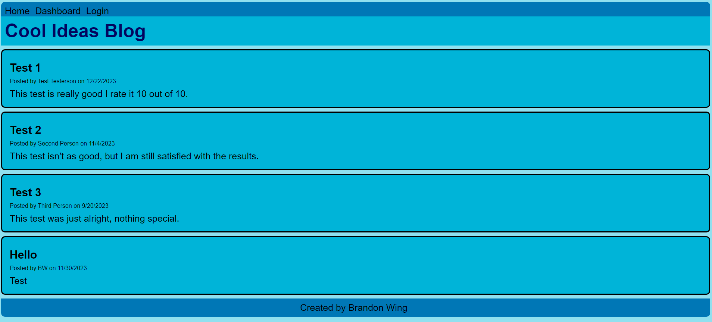
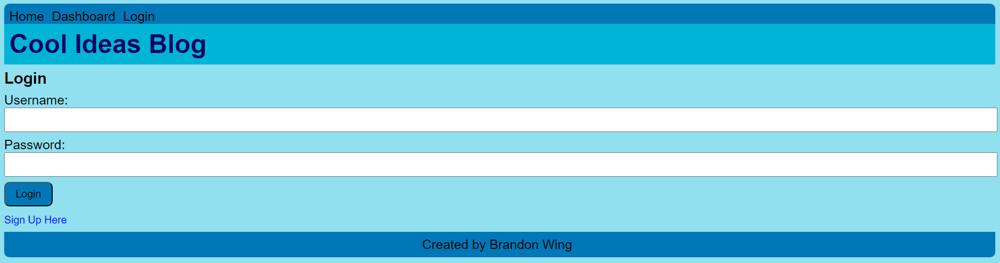
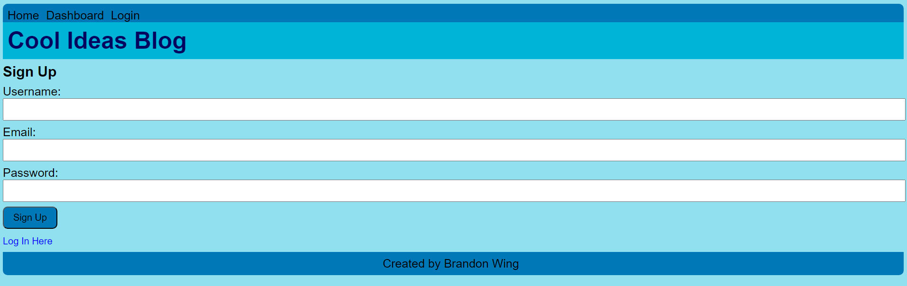
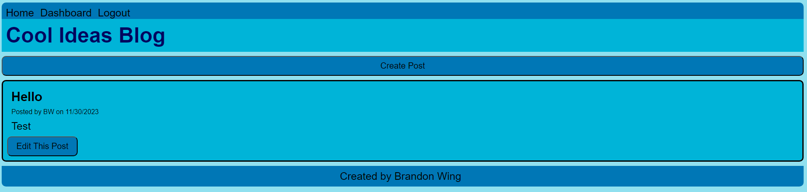
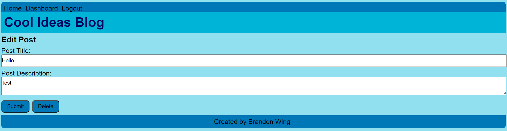
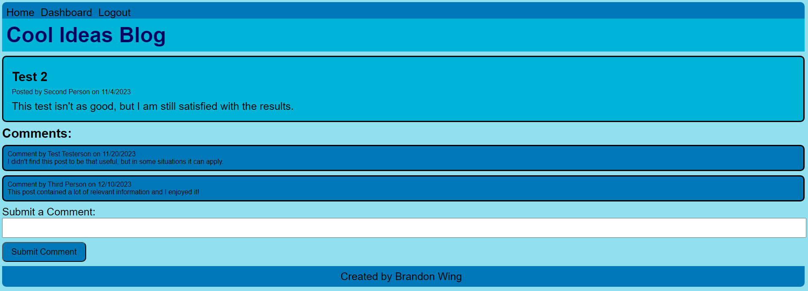

# Cool Ideas Blog - MVC Blog Website

[Live Deploy Link]()

## Description

This project is creating a blog style website that integrates both front end and backend data. The MVC or Model View Controller formatting allows for better readability and maintainability in the future. `Express`, `express-handlebars`, `bcrypt`, and more are used. This allows for authentication, session storage, login data, creating, deleting, and viewing posts/comments.

## Table of contents

- [Installation](#installation)
- [Usage](#usage)
- [License](#license)
- [Questions](#questions)

## Installation

This application does not need to be installed to run, as it is deployed on Heroku. However if users would like to see the code, the instructions for downloading and setting up are down below.

1. Clone the repository from `GitHub`.
2. Install or have `Node.js` installed.
3. Install or have `MySQL` and set up an account.
4. Open the cloned repository in VSCode.
5. Open the project inside the integrated terminal.
6. Install all package dependencies using `npm i`.
7. This will install the modules `dotenv`, `express`, `express-handlebars`, `express-session`, `connect-session-sequelize`, `mysql2`, `sequelize`, and `bcrypt`.
8. Set up the database by running the `schema.sql` in the `db` folder using the `MySQL` script in the terminal `mysql -u personal_username -p`.
9. Exit `MySQL` and run the `npm run seed` command in the terminal.
10. This will create the seed data used for the tables.
11. Make sure to update the `.env` file as well as the `connection.js` file in the `config` folder.
12. Use the command `npm start`, and the application will run.

## Usage

1. Sequelize Database: Allows for interaction with databases with many features including creating models, CRUD, validation, and querying.
1. Handlebars Views: All of the frontend of this application is created using a templating engine.
1. Express.js framework: Provides all of the tools to create an application that has use for server-side and client-side interactions.
1. Saved Sessions: Users will be able to stay logged in for a set amount of time, and can return to the
1. Bcrypt Password Hashing: All login information is saved to the database, but passwords are hashed so they are not traceable.
1. Add Comments: Comments can be added to posts if the user is logged in.

### Home Page

### Login Page

### Sign Up Page

### Dashboard Page

### Dashboard Editing Page

### Post With Comments

## License

Licensed under [MIT](https://opensource.org/license/mit/)

## Questions

You are welcome to contact me with questions using the following:

- [GitHub Profile](https://github.com/bwing2)

- [Email](mailto:brandon.wing245@gmail.com)
